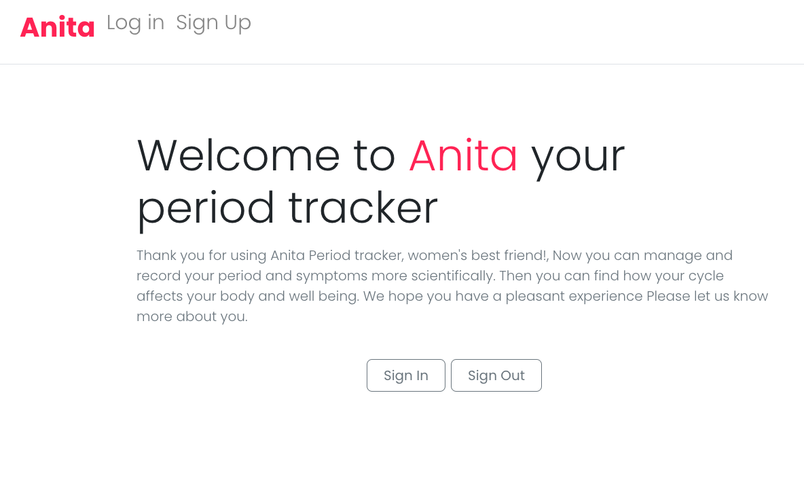

# Anita - Cycle tracker

Cycle tracker is a website that helps women for monitoring their menstrual cycle and helping to predict periods. It also allows users to record additional information, such as symptoms that occured in a selected day and period flow.

After sign up, the user is redirected to the "About you" page, where they insert useful information that will be used to predict future periods. Users also has access to your 'one-year' cycle forecast.

This project was designed for project2 for the Immersive Software Engineer course from General Assembly, where a full stack development app techiniques were intended to be developed.

This repository contains the frontend code project. Ruby on Rails repository is [here](https://github.com/isabelsousac/Cycle-Tracker).

Project designed by [Isabel](https://github.com/isabelsousac), [Gissell](https://github.com/Gissell10) and [Kylie](https://github.com/kyliexmq).

## Website

This repository application can be accessed through [here](https://cycle-tracker-app.herokuapp.com/)

## Stack
 * React
 * JavaScript
 * HTML
 * CSS
 * Bootstrap

## Future improvements
* Clicking on one cycle should show information about itself, such as symptoms that occured between it.
* Make possible for woman to share their logs with their patners.
* Add period start and birth control pill notification, for users that have chosen to receive previously.
* Besides symptoms, users can log other things, such as 'sex activity' and 'humor changes'.

## Acknowledgements
Special thanks to [The Blade](https://github.com/wofockham) and  [Loden Gendun](https://github.com/Tenzang) for all the patience and guidance.